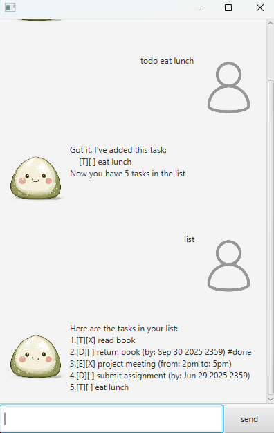

# Mochi User Guide

Mochi is a **desktop app for managing your tasks, optimized for use via a command line interface**, while still having 
benefits of a Graphical User Interface (GUI). If you can type fast, Mochi can get your productivity tasks done faster 
than traditional GUI apps.
* [Quick Start](#quick-start)
* [Features](#features)
    * [Adding a todo task: `todo`](#adding-a-todo-task-todo)
    * [Adding a deadline task: `deadline`](#adding-a-deadline-task-deadline)
    * [Adding a event task: `event`](#adding-a-event-task-event)
    * [Listing all tasks: `list`](#listing-all-tasks-list)
    * [Marking a task as done: `mark`](#marking-a-task-as-done-mark)
    * [Unmarking a task as done: `unmark`](#unmarking-a-task-as-done-unmark)
    * [Deleting a task: `delete`](#deleting-a-task-delete)
    * [Finding tasks by name: `find`](#finding-tasks-by-name-find)
    * [Tagging a task: `tag`](#tagging-a-task-tag)
    * [Untagging a task: `untag`](#untagging-a-task-untag)
    * [Exiting the program: `bye`](#exiting-the-program-bye)
* [Saving the data](#saving-the-data)
* [Command summary](#command-summary)

## Quick start
1. Ensure you have Java `17` or above installed in your Computer.
2. Download the latest `mochi.jar` from [here](https://github.com/AY2122S2-CS2103T-T11-3/tp/releases).
3. Copy the file to the folder you want to use as the _home folder_ for your Mochi.
4. Double-click the file to start the app. The GUI similar to the below should appear in a few seconds. Note how the app contains some sample data. 
   
5. Type the command in the command box and press Enter to execute it.\
   Some example commands you can try: 
    - `todo read book`: Adds a todo task to the list.
    - `list`: Lists all tasks.
    - `mark 1`: marks the 1st task shown in the current list.
    - `bye`: Exits the app.
6. Refer to the [Features](#features) below for details of each command.
    

## Features

### Adding a todo task: `todo`
Format: `todo TASK_NAME`\
Example: `todo read book`

### Adding a deadline task: `deadline`
Format: `deadline TASK_NAME /by DATE TIME`\
Date and time must be in the format `yyyy-MM-dd HH:mm`\
Example: `deadline buy milk /by 2022-01-01 12:00`\
Optional arguments: If `TIME` is not specified, the default time is `23:59`.

### Adding a event task: `event`
Format: `event TASK_NAME /from FROM /to TO`\
`FROM` and `TO` must not be in any specified format\
Example: `event go to school /from 9am /to 6pm`\

### Listing all tasks: `list`
Shows a list of all tasks in the task list.

### Marking a task as done: `mark`
Marks the task at the specified `INDEX` as done.
Format: `mark INDEX`\

### Unmarking a task as done: `unmark`
Unmarks the task at the specified `INDEX` as done.
Format: `unmark INDEX`\

### Deleteting a task: `delete`
Deletes the task at the specified `INDEX`.
Format: `delete INDEX`\

### Finding tasks by name: `find`
Finds all tasks whose names contain any of the given keywords.
Format: `find KEYWORD`\

### Tagging a task: `tag`
Tags the task at the specified `INDEX` with the specified `TAG`.
Format: `tag INDEX TAG`\
Example: `tag 1 homework`

### Untagging a task: `untag`
Untags the task at the specified `INDEX`.
Format: `untag INDEX`\
Example: `untag 1`

### Exiting the program: `bye`
Exits the program.

## Saving the data
Mochi data are saved in the hard disk automatically after any command that changes the data.\
There is no need to save manually.

## Command summary

| Action   | Format Examples                     |
|:---------|:------------------------------------|
| todo     | `todo TASK_NAME`                    |
| deadline | `deadline TASK_NAME /by DATE TIME`  |
| event    | `event TASK_NAME /from FROM /to TO` | 
| list     | `list`                              | 
| mark     | `mark INDEX`                        | 
| unmark   | `unmark INDEX`                      | 
| delete   | `delete INDEX`                      | 
| find     | `find KEYWORD`                      | 
| tag      | `tag INDEX TAG`                     | 
| untag    | `untag INDEX`                       |
| bye      | `bye`                               |